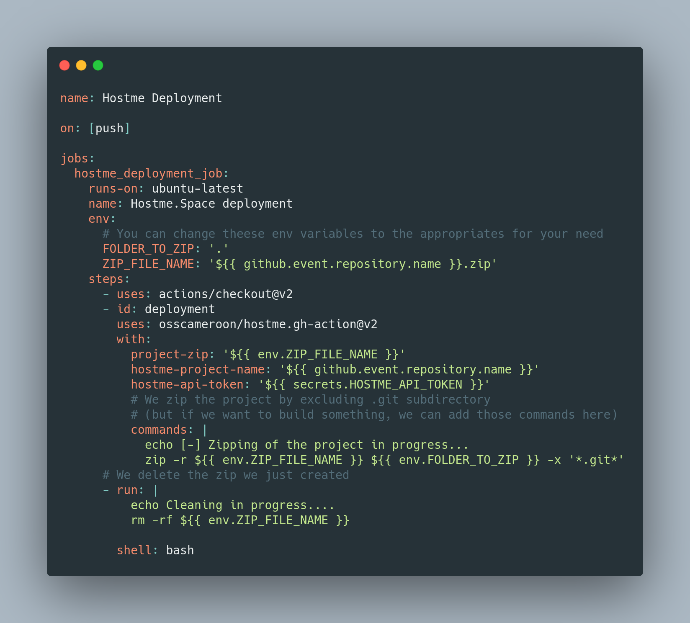

### Hostme-Github-Deployment-Integration-Example
Just have a look inside `./github/workflows/main.yml` to see how the deployment is made !
The main project for that github action is available here : https://github.com/osscameroon/hostme.gh-action !

